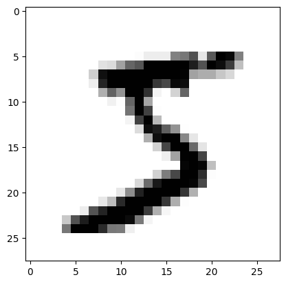
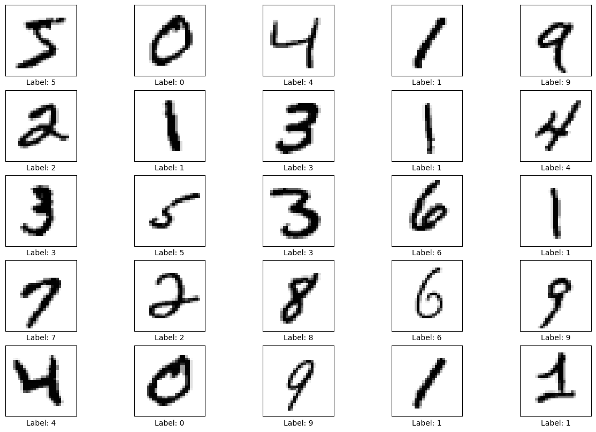
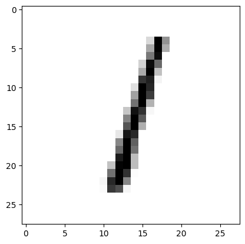
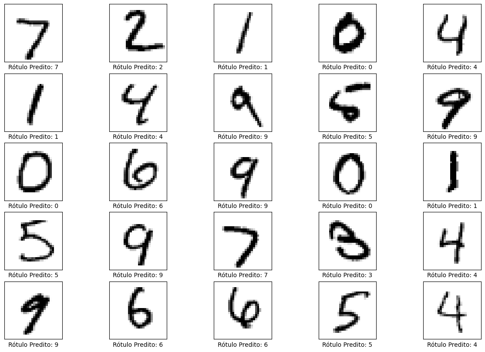

# Deep Learning - A simple CNN to predict MNIST dataset

## 📒 What is MNIST dataset❓

Introduced by Yann LeCun and colleagues in the 1990s, the MNIST dataset has played a significant role in the development and evaluation of new algorithms in the field of machine learning and deep learning.

The MNIST dataset (Modified National Institute of Standards and Technology dataset) consists of a large database of handwritten digits. Here are some key points about the MNIST dataset:

1. **Content**: It contains 60,000 training images and 10,000 testing images of handwritten digits (0-9). Each image is 28x28 pixels in grayscale.
2. **Format**: The images are standardized, meaning each image is centered and size-normalized. Each pixel value ranges from 0 to 255, where 0 represents white and 255 represents black.
3. **Usage**: The dataset is widely used for benchmarking machine learning algorithms, particularly in the field of image recognition and classification. It's a common introductory dataset for learning and experimenting with neural networks and other machine learning models.
4. **Accessibility**: The dataset is publicly available and can be easily accessed through various machine learning libraries, such as TensorFlow, PyTorch, and Keras.

## 📒 What is Convolutional Neural Network - CNN❓

A CNN is a type of deep learning algorithm specifically designed for processing structured grid data, such as images. CNNs are particularly effective for tasks such as image recognition, classification, and detection due to their ability to automatically and adaptively learn spatial hierarchies of features.

Here are some key components and concepts associated with CNNs:

1. **Convolutional Layers**: These layers apply a convolution operation to the input, passing the result to the next layer. Convolutional layers consist of a set of learnable filters (or kernels) that are convolved with the input image to produce feature maps. Each filter detects different features, such as edges, textures, or more complex patterns.
2. **ReLU Activation Function**: After each convolution operation, an activation function like the Rectified Linear Unit (ReLU) is applied. ReLU introduces non-linearity to the model, enabling it to learn more complex patterns.
3. **Pooling Layers**: Also known as subsampling or downsampling, pooling layers reduce the dimensionality of each feature map while retaining the most important information. Max pooling, which takes the maximum value from a set of values in a feature map, is a common type of pooling.
4. **Fully Connected Layers**: These layers are typically used towards the end of the network. Neurons in a fully connected layer have connections to all activations in the previous layer. They are responsible for combining the features extracted by the convolutional and pooling layers to make the final classification or prediction.
5. **Flattening**: Before passing the data to fully connected layers, the output from the convolutional and pooling layers is often flattened into a one-dimensional vector.
6. **Dropout**: This regularization technique involves randomly setting a fraction of input units to zero during training. Dropout helps prevent overfitting by ensuring that the model generalizes better to new data.
7. **Training**: CNNs are trained using backpropagation and gradient descent. The objective is to minimize the loss function by adjusting the weights and biases of the network through iterative updates.

CNNs have achieved state-of-the-art performance in many computer vision tasks, including object detection, facial recognition, and medical image analysis, among others.

Therefore, I utilized a CNN to predict handwritten digits from the MNIST dataset.

### Let's do it❗

## 👨‍💻 Programming language

- 

## 📦 Libraries necessaries

```{python}
import numpy as np
import keras
from keras import layers
import matplotlib.pyplot as plt
import tensorflow as tf
```

# 💻 Preparing the data

```{python}
# Modelo / paramêtros dos dados
num_classes = 10
input_shape = (28, 28, 1)

# Downlaod dos dados e divição em conjuntos de treinamento e teste
(x_train, y_train), (x_test, y_test) = keras.datasets.mnist.load_data()

# Dimensione imagens para o intervalo [0, 1]
x_train = x_train.astype("float32") / 255
x_test = x_test.astype("float32") / 255

# Certifique-se de que as imagens tenham formato (28, 28, 1)
x_train = np.expand_dims(x_train, -1)
x_test = np.expand_dims(x_test, -1)
print("x_train shape:", x_train.shape)
print(x_train.shape[0], "train samples")
print(x_test.shape[0], "test samples")

# converter vetores de classe em matrizes de classe binárias
y_train = keras.utils.to_categorical(y_train, num_classes)
y_test = keras.utils.to_categorical(y_test, num_classes)
```

```
# output
x_train shape: (60000, 28, 28, 1)
60000 train samples
10000 test samples
```

## 🧐 Looking handwritten digits images

```{python}
plt.imshow(x_train[0], cmap=plt.cm.binary)
```



Le'ts see 10 imagens and its labels.

```{python}
# Visualizar 10 imagens e seus rótulos
plt.figure(figsize=(15,10))
for i in range(25):
  plt.subplot(5,5,i+1)
  plt.xticks([])
  plt.yticks([])
  plt.imshow(x_train[i], cmap=plt.cm.binary)
  plt.xlabel(f'Label: {np.argmax(y_train[i])}')
plt.show()
```



## 💻🧠 Model - Convolutional Neural Network - CNN

The CNN architecture used was developmented by François Chollet. 

This CNN achieved ~99% test accuracy.

The code is available in the [Google Colab](https://colab.research.google.com/github/keras-team/keras-io/blob/master/examples/vision/ipynb/mnist_convnet.ipynb#scrollTo=xo9HwpE5gmQB).


### 🤔 Who is François Chollet?

François Chollet is a well-known figure in the field of artificial intelligence and deep learning. 

He is the creator of Keras, one of the most popular libraries for deep learning (being used here❗), an interface for the TensorFlow library, among others, that simplifies the process of developing complex neural networks.

He has contributed to various research areas within machine learning and artificial intelligence, including computer vision, natural language processing, and the development of new machine learning architectures.

So, it is a good idea to use a CNN architecture development by him 😜.

```{python}
model = keras.Sequential(
    [
        keras.Input(shape=input_shape),
        layers.Conv2D(32, kernel_size=(3, 3), activation="relu"),
        layers.MaxPooling2D(pool_size=(2, 2)),
        layers.Conv2D(64, kernel_size=(3, 3), activation="relu"),
        layers.MaxPooling2D(pool_size=(2, 2)),
        layers.Flatten(),
        layers.Dropout(0.5),
        layers.Dense(num_classes, activation="softmax"),
    ]
)
model.summary()
```

#### Model Summary

<pre style="white-space:pre;overflow-x:auto;line-height:normal;font-family:Menlo,'DejaVu Sans Mono',consolas,'Courier New',monospace">┏━━━━━━━━━━━━━━━━━━━━━━━━━━━━━━━━━┳━━━━━━━━━━━━━━━━━━━━━━━━┳━━━━━━━━━━━━━━━┓
┃<span style="font-weight: bold"> Layer (type)                    </span>┃<span style="font-weight: bold"> Output Shape           </span>┃<span style="font-weight: bold">       Param # </span>┃
┡━━━━━━━━━━━━━━━━━━━━━━━━━━━━━━━━━╇━━━━━━━━━━━━━━━━━━━━━━━━╇━━━━━━━━━━━━━━━┩
│ conv2d (<span style="color: #0087ff; text-decoration-color: #0087ff">Conv2D</span>)                 │ (<span style="color: #00d7ff; text-decoration-color: #00d7ff">None</span>, <span style="color: #00af00; text-decoration-color: #00af00">26</span>, <span style="color: #00af00; text-decoration-color: #00af00">26</span>, <span style="color: #00af00; text-decoration-color: #00af00">32</span>)     │           <span style="color: #00af00; text-decoration-color: #00af00">320</span> │
├─────────────────────────────────┼────────────────────────┼───────────────┤
│ max_pooling2d (<span style="color: #0087ff; text-decoration-color: #0087ff">MaxPooling2D</span>)    │ (<span style="color: #00d7ff; text-decoration-color: #00d7ff">None</span>, <span style="color: #00af00; text-decoration-color: #00af00">13</span>, <span style="color: #00af00; text-decoration-color: #00af00">13</span>, <span style="color: #00af00; text-decoration-color: #00af00">32</span>)     │             <span style="color: #00af00; text-decoration-color: #00af00">0</span> │
├─────────────────────────────────┼────────────────────────┼───────────────┤
│ conv2d_1 (<span style="color: #0087ff; text-decoration-color: #0087ff">Conv2D</span>)               │ (<span style="color: #00d7ff; text-decoration-color: #00d7ff">None</span>, <span style="color: #00af00; text-decoration-color: #00af00">11</span>, <span style="color: #00af00; text-decoration-color: #00af00">11</span>, <span style="color: #00af00; text-decoration-color: #00af00">64</span>)     │        <span style="color: #00af00; text-decoration-color: #00af00">18,496</span> │
├─────────────────────────────────┼────────────────────────┼───────────────┤
│ max_pooling2d_1 (<span style="color: #0087ff; text-decoration-color: #0087ff">MaxPooling2D</span>)  │ (<span style="color: #00d7ff; text-decoration-color: #00d7ff">None</span>, <span style="color: #00af00; text-decoration-color: #00af00">5</span>, <span style="color: #00af00; text-decoration-color: #00af00">5</span>, <span style="color: #00af00; text-decoration-color: #00af00">64</span>)       │             <span style="color: #00af00; text-decoration-color: #00af00">0</span> │
├─────────────────────────────────┼────────────────────────┼───────────────┤
│ flatten (<span style="color: #0087ff; text-decoration-color: #0087ff">Flatten</span>)               │ (<span style="color: #00d7ff; text-decoration-color: #00d7ff">None</span>, <span style="color: #00af00; text-decoration-color: #00af00">1600</span>)           │             <span style="color: #00af00; text-decoration-color: #00af00">0</span> │
├─────────────────────────────────┼────────────────────────┼───────────────┤
│ dropout (<span style="color: #0087ff; text-decoration-color: #0087ff">Dropout</span>)               │ (<span style="color: #00d7ff; text-decoration-color: #00d7ff">None</span>, <span style="color: #00af00; text-decoration-color: #00af00">1600</span>)           │             <span style="color: #00af00; text-decoration-color: #00af00">0</span> │
├─────────────────────────────────┼────────────────────────┼───────────────┤
│ dense (<span style="color: #0087ff; text-decoration-color: #0087ff">Dense</span>)                   │ (<span style="color: #00d7ff; text-decoration-color: #00d7ff">None</span>, <span style="color: #00af00; text-decoration-color: #00af00">10</span>)             │        <span style="color: #00af00; text-decoration-color: #00af00">16,010</span> │
└─────────────────────────────────┴────────────────────────┴───────────────┘
</pre>

- Total params: 34,826 (136.04 KB)

- Trainable params: 34,826 (136.04 KB)

- Non-trainable params: 0 (0.00 B)

## 👨‍💻 Defining a callback, loss function, optimizer and, a model performance metric.

```{python}
batch_size = 128
epochs = 15

# Callback para interromper o treinamento se a acurácia atingir 90%
class myCallback(tf.keras.callbacks.Callback):
  def on_epoch_end(self, epoch, logs={}):
    if(logs.get('accuracy')>0.99):
      print("\nReached 90% accuracy so cancelling training!")
      self.model.stop_training = True

callbacks = myCallback()


# Adicionar paramêtros (loss function, otimizador e métrica de avaliação)
model.compile(loss='categorical_crossentropy',
              optimizer='adam',
              metrics=['accuracy'])
```

## 🖥️🪫 Training the model
```{python}
model.fit(x_train, y_train, epochs=epochs, batch_size=batch_size, callbacks=[callbacks], validation_split=0.1, verbose=2)
```
Epoch 1/15
422/422 - 6s - 14ms/step - accuracy: 0.8906 - loss: 0.3653 - val_accuracy: 0.9763 - val_loss: 0.0905
Epoch 2/15
422/422 - 5s - 12ms/step - accuracy: 0.9649 - loss: 0.1135 - val_accuracy: 0.9848 - val_loss: 0.0635
Epoch 3/15
422/422 - 5s - 13ms/step - accuracy: 0.9749 - loss: 0.0832 - val_accuracy: 0.9868 - val_loss: 0.0493
Epoch 4/15
422/422 - 5s - 12ms/step - accuracy: 0.9786 - loss: 0.0695 - val_accuracy: 0.9883 - val_loss: 0.0430
Epoch 5/15
422/422 - 5s - 12ms/step - accuracy: 0.9808 - loss: 0.0619 - val_accuracy: 0.9877 - val_loss: 0.0431
Epoch 6/15
422/422 - 5s - 13ms/step - accuracy: 0.9825 - loss: 0.0548 - val_accuracy: 0.9902 - val_loss: 0.0368
Epoch 7/15
422/422 - 6s - 13ms/step - accuracy: 0.9840 - loss: 0.0509 - val_accuracy: 0.9908 - val_loss: 0.0339
Epoch 8/15
422/422 - 6s - 13ms/step - accuracy: 0.9853 - loss: 0.0464 - val_accuracy: 0.9917 - val_loss: 0.0319
Epoch 9/15
422/422 - 6s - 14ms/step - accuracy: 0.9858 - loss: 0.0444 - val_accuracy: 0.9913 - val_loss: 0.0324
Epoch 10/15
422/422 - 6s - 13ms/step - accuracy: 0.9870 - loss: 0.0410 - val_accuracy: 0.9918 - val_loss: 0.0295
Epoch 11/15
422/422 - 5s - 13ms/step - accuracy: 0.9876 - loss: 0.0392 - val_accuracy: 0.9917 - val_loss: 0.0324
Epoch 12/15
422/422 - 5s - 13ms/step - accuracy: 0.9881 - loss: 0.0377 - val_accuracy: 0.9918 - val_loss: 0.0321
Epoch 13/15
422/422 - 6s - 14ms/step - accuracy: 0.9892 - loss: 0.0334 - val_accuracy: 0.9915 - val_loss: 0.0310
Epoch 14/15
422/422 - 6s - 14ms/step - accuracy: 0.9888 - loss: 0.0349 - val_accuracy: 0.9915 - val_loss: 0.0296
Epoch 15/15
422/422 - 6s - 13ms/step - accuracy: 0.9894 - loss: 0.0334 - val_accuracy: 0.9925 - val_loss: 0.0280

## 🎯 Evaluate the trained model
```{python}
score = model.evaluate(x_test, y_test, verbose=0)
print("Test loss:", round(score[0], 2))
print("Test accuracy:", round(score[1], 2))
```
```
# output
Test loss: 0.03
Test accuracy: 0.99
```
## 🧐 Looking the predictions
predictions = model.predict(x_test)

### Example - index 2

```{python}
np.array(predictions[2])
```
```
# output
array([3.5812522e-07, 9.9980086e-01, 2.3836508e-06, 1.3840857e-08,
       1.1062459e-04, 5.9761607e-07, 8.4169500e-07, 7.3724128e-05,
       1.0268027e-05, 3.2870500e-07], dtype=float32)
```

```{python}
np.argmax(predictions[2])
```

```
# output
1
```
As we can see, the highest probability is at index 1 (i.e., 9.99), indicating the value 1.
```

## Let's see the image❗

```{python}
plt.figure()
plt.imshow(x_test[2], cmap=plt.cm.binary)
plt.show()
```


## 🧐 Now, let's see 25 examples and predicted labels.

```{python}
plt.figure(figsize=(15,10))
for i in range(25):
  plt.subplot(5,5,i+1)
  plt.xticks([])
  plt.yticks([])
  plt.imshow(x_test[i], cmap=plt.cm.binary)
  plt.xlabel(f'Rótulo Predito: {np.argmax(predictions[i])}')
plt.show()
```


## 🤓 Conclusion

Indeed, the CNN architecture was able to predict accurately handwritten digits.

This is a simple application of CNNs, but it is noteworthy that this technique has been used to address complex real-world problems.

Hope you enjoyed it!


## Reference

1. [The MNIST database of handwritten digits](http://yann.lecun.com/exdb/mnist/)
2. [Chollet, F. A simple convnet that achieves ~99% test accuracy on MNIST.](https://colab.research.google.com/github/keras-team/keras-io/blob/master/examples/vision/ipynb/mnist_convnet.ipynb#scrollTo=xo9HwpE5gmQB)

👨‍💻 Made by Saulo Gil.